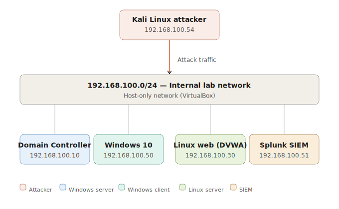

# Lab Architecture & Technical Details

## Network Topology

---

## Virtual Machine Specifications

### Domain Controller (DC-01)
- **OS:** Windows Server 2019 Standard
- **IP:** 192.168.100.10 (Static)
- **RAM:** 4GB
- **CPU:** 2 vCPUs
- **Disk:** 60GB
- **Roles:**
  - Active Directory Domain Services
  - DNS Server
  - DHCP Server
  - RRAS (Routing and Remote Access) - NAT Router
- **Domain:** lab.local
- **Splunk Forwarder:** Universal Forwarder 9.1.3
- **Log Sources:**
  - Windows Security Event Log
  - Windows System Event Log
  - Windows Application Event Log
  - DNS Server logs
  - DHCP Server logs

---

### Windows 10 Client (WIN10-CLIENT)
- **OS:** Windows 10 Pro 22H2
- **IP:** 192.168.100.50 (DHCP)
- **RAM:** 4GB
- **CPU:** 2 vCPUs
- **Disk:** 50GB
- **Domain Status:** Joined to CORP.local
- **User:** kouraich@CORP.local
- **Monitoring:**
  - Sysmon 15.0 (SwiftOnSecurity config)
  - Splunk Universal Forwarder 9.1.3
- **Log Sources:**
  - Windows Security Event Log
  - Sysmon/Operational
  - Windows Firewall logs (pfirewall.log)
  - PowerShell Operational logs

---

### Linux Web Server (WEB-01)
- **OS:** Ubuntu 22.04.5 LTS
- **IP:** 192.168.100.30 (Static)
- **RAM:** 3GB
- **CPU:** 2 vCPUs
- **Disk:** 40GB
- **Services:**
  - Apache2 2.4.52
  - PHP 8.1
  - MySQL 8.0
  - DVWA (Damn Vulnerable Web Application)
  - SSH (OpenSSH 8.9p1)
- **Monitoring:**
  - Splunk Universal Forwarder 9.1.3
- **Log Sources:**
  - /var/log/auth.log (SSH authentication)
  - /var/log/apache2/access.log (HTTP requests)
  - /var/log/apache2/error.log (Web errors)
  - /var/log/syslog (System logs)

---

### Splunk SIEM Server (SPLUNK-01)
- **OS:** Ubuntu 22.04.5 LTS
- **IP:** 192.168.100.51 (Static)
- **RAM:** 8GB
- **CPU:** 4 vCPUs
- **Disk:** 100GB
- **Software:**
  - Splunk Enterprise 9.1.3 (Free License)
- **Receiving Port:** 9997 (Splunk forwarder protocol)
- **Web Interface:** https://192.168.100.51:8000
- **Indexes:**
  - main (default - all forwarded logs)
- **Sourcetypes Configured:**
  - windows:firewall:log
  - linux:auth
  - apache:access
  - apache:error
  - WinEventLog:Security
  - WinEventLog:Sysmon/Operational
  - WinEventLog:System
  - WinEventLog:Application

---

### Kali Linux Attacker (KALI-ATTACKER)
- **OS:** Kali Linux 2024.1
- **IP:** 192.168.100.54 (Static)
- **RAM:** 4GB
- **CPU:** 2 vCPUs
- **Disk:** 60GB
- **Tools Installed:**
  - Nmap 7.94
  - Hydra 9.6
  - Metasploit Framework 6.3
  - Burp Suite Community
  - sqlmap 1.8
  - gobuster
  - nikto
  - crackmapexec
- **Purpose:** Controlled attack simulation

---

## Network Configuration

### Subnet Details
- **Network:** 192.168.100.0/24
- **Subnet Mask:** 255.255.255.0
- **Gateway:** 192.168.100.10 (DC NAT)
- **DNS Server:** 192.168.100.10
- **DHCP Range:** 192.168.100.100-200

### Routing
- DC (192.168.100.10) acts as NAT router via RRAS
- All VMs route internet traffic through DC
- VMs can communicate directly on internal network

---

## Data Flow
Windows Endpoints → Splunk Universal Forwarder → Splunk SIEM (Port 9997)
Linux Server      → Splunk Universal Forwarder → Splunk SIEM (Port 9997)
Kali Attacker     → Generates traffic           → Logged by targets

---

## Hypervisor & Host Details

- **Hypervisor:** Oracle VirtualBox 7.0
- **Host OS:** [Your host OS]
- **Host RAM:** 32GB total
- **Simultaneous VMs:** Maximum 3-4 running concurrently
- **Network Mode:** Internal Network (isolated from host network)

---

## Security Considerations

### Isolation
- ✅ Lab network isolated from production/home network
- ✅ No external internet access from attack VM
- ✅ All attacks contained within lab environment

### Snapshots
- Baseline snapshots taken after initial configuration
- Pre-attack snapshots for easy rollback
- Post-attack snapshots for evidence preservation

